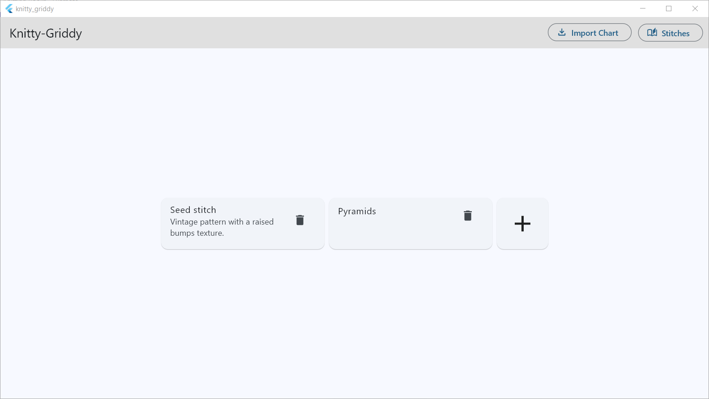
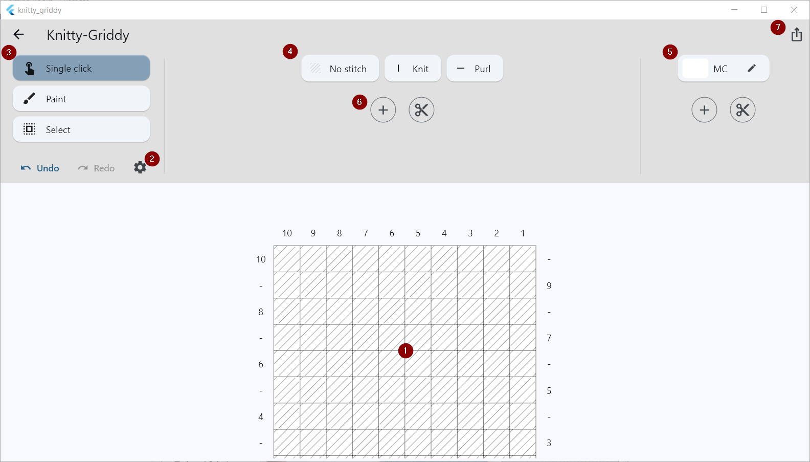
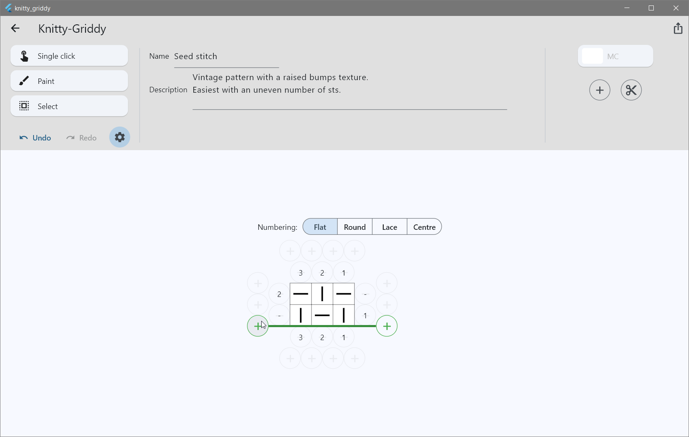
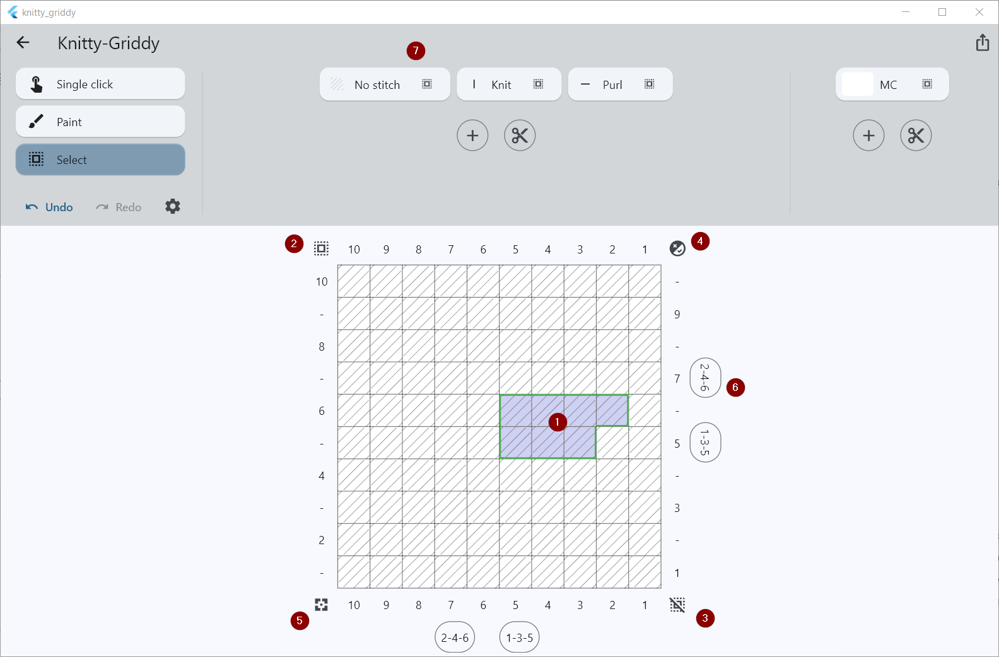
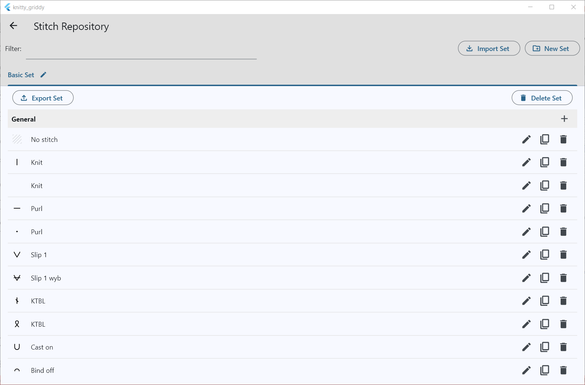
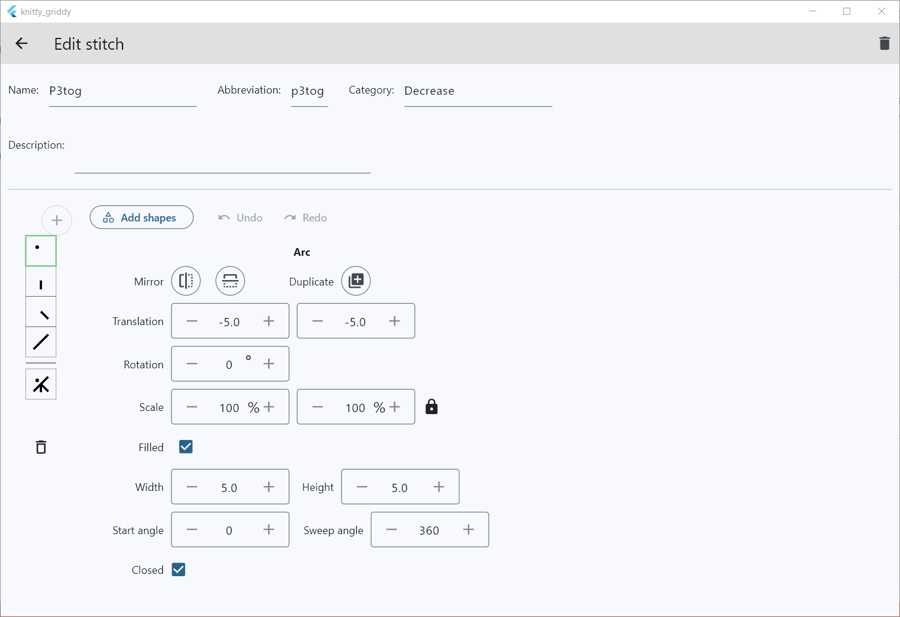
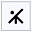
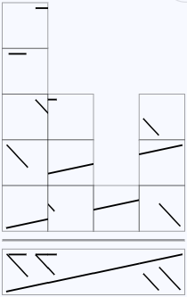

# KnittyGriddy

Welcome to KnittyGriddy, a tool to create knitting patterns. Currently, it allows you to create stitch charts, but later it will allow creating complete patterns with those charts.

When you first open the application, the chart chooser is shown. This screen gives an overview of all the charts you created and allows you to import charts shared by others.

The top-right button takes you to the stitch repository (see further).

Click on an existing chart or click the + button to create a new one. Both actions will take you to the chart editor.

1. The chart grid, where you draw stitches and colours.
2. Settings. In this mode, you can choose between different row numbering schemes and add or remove rows and columns

3. Drawing tools
    - Single-click allows you to paint stitches or colours on the grid with single mouse-clicks
    - Paint acts as a paint brush for stitches and colours
    - Select allows you to select regions of the grid to fill with stitches and colours
4. In Single-click or Paint mode, select a stitch to start drawing. In select mode, click a stitch to fill a region of the grid
5. Colours work exactly the same as stitches. Click the pencil button to edit the main colour.
6. Click the + button to choose more stitches from the stitch repository or to create more colours. The scissor buttons will limit the list to stitches or colours used in the chart.
7. Export the chart to PNG or SVG format. Or save it as a chart file to share it with other KnittyGriddy users.

#### Select mode

When you choose the Select drawing tool, the screen shows controls to select regions on the chart grid

1. The current selection is shown in a contrasting colour on the grid.
2. Select the entire grid
3. Clear the selection
4. Invert the current selection
5. Set the pattern repeat outline
6. Click the row and column numbers to toggle the selection of entire rows and columns. The buttons labeled 2-4-6 and 1-3-5 toggle even and odd rows or columns.
7. Click a stitch or colour to fill the current selection. Click the  icon to select/unselect all cells of the grid with that stitch or colour.

### Stitch Repository

From the chart chooser, you can click the top-right button to go to the stitch repository.

Stitches in KnittyGriddy are grouped in sets and further divided in categories. By default, it ships with a Basic Set, which contains stitches based on the [craft-yarn-council chart symbols](https://www.craftyarncouncil.com/standards/knit-chart-symbols). You can also import sets shared by other people, or create your own sets with the integrated editor.

All stitches can be edited, and all stitches in the Basic Set have been created with the built-in editor. A click on the pencil icon in an existing stitch row or a click the + button on a category hearder will take you there.

Example: p3tog

Each stitch consists of one or more symbols, one for each column the stitch takes up on the chart grid. In the example of p3tog, there is just one symbol .
More complex stitches like cable stitches can take up multiple columns. For example, the 4-st RPC has 4 symbols and takes up 4 cells in the chart grid.

Each symbol consists of basic shapes - rectangle, arc, curve, text and SVG path - placed on top of each other.
Each shape and symbol can be manipulated with the editor tools.

